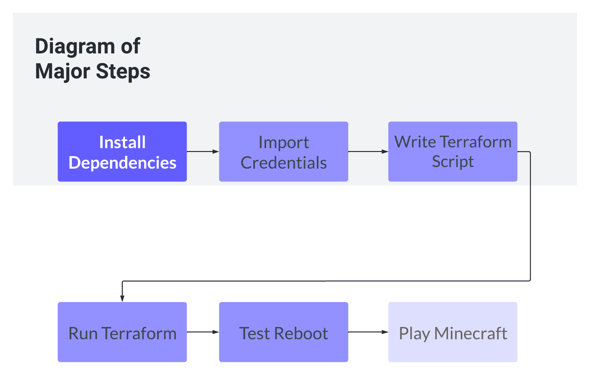
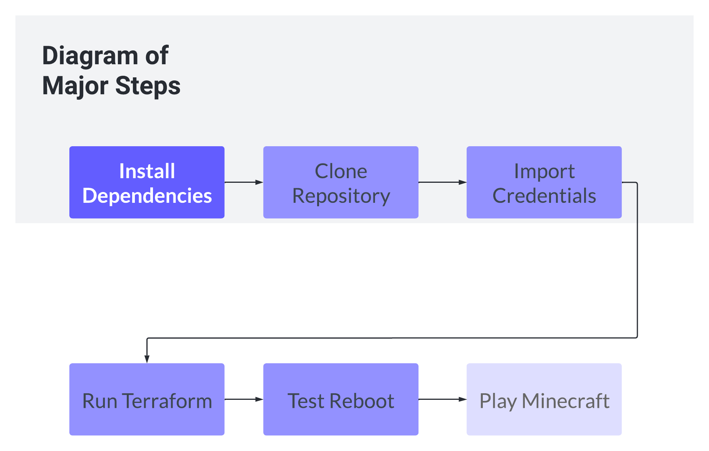

# Minecraft-2.0
## [Video Link](https://clipchamp.com/watch/CCHYsbnp36w
## Background

### What Will We Do?

Make a Minecraft server using an AWS account that is able to auto reboot and shutdown with systemd services

### How Will We Do it?

Using Git/GitHub, Terraform, AWS and the AWS command line interface, and Docker!

## Requirements

- Personal computer/laptop with WiFi or Ethernet access
- An AWS account
     - Note: This tutorial is made using the AWS Academy, so results may vary if you're using a regular AWS account
- Git installed
    - Linux: `sudo apt install git-all` or `sudo dnf install git-all`
    - MacOS: `git --version`
    - Windows: [Installation Link](https://git-scm.com/download/win)
    - [Help](https://git-scm.com/book/en/v2/Getting-Started-Installing-Git)
 - Terraform installed
     - Linux - Debian-based: [Script](https://github.com/awhittle2/Minecraft-2.0/blob/linux-terraform-install.sh)
     - Linux - RHEL-based: [Script](https://github.com/awhittle2/Minecraft-2.0/blob/linux-terraform-install2.sh)
     - MacOS: [Script](https://github.com/awhittle2/Minecraft-2.0/blob/mac-terraform-install.sh)
     - Windows - Chocolatey: `choco install terraform`
     - [Help](https://developer.hashicorp.com/terraform/tutorials/aws-get-started/install-cli)
 - AWC CLI installed
     - Linux: `curl "https://awscli.amazonaws.com/awscli-exe-linux-x86_64.zip" -o "awscliv2.zip"
               unzip awscliv2.zip
               sudo ./aws/install`
     - MacOS: `curl "https://awscli.amazonaws.com/AWSCLIV2.pkg" -o "AWSCLIV2.pkg"
               sudo installer -pkg AWSCLIV2.pkg -target /`
     - Windows: `msiexec.exe /i https://awscli.amazonaws.com/AWSCLIV2.msi`
     - [Help](https://docs.aws.amazon.com/cli/latest/userguide/getting-started-install.html)
 - A Minecraft Client
     - Note: This will still work without one, however, you wouldn't be able to play minecraft without it!

## Diagram of My Steps

## Diagram of Your Steps

## List of Commands to Run

## Explanation of Terraform Script

## How to connect to the Minecraft server once it's running?
