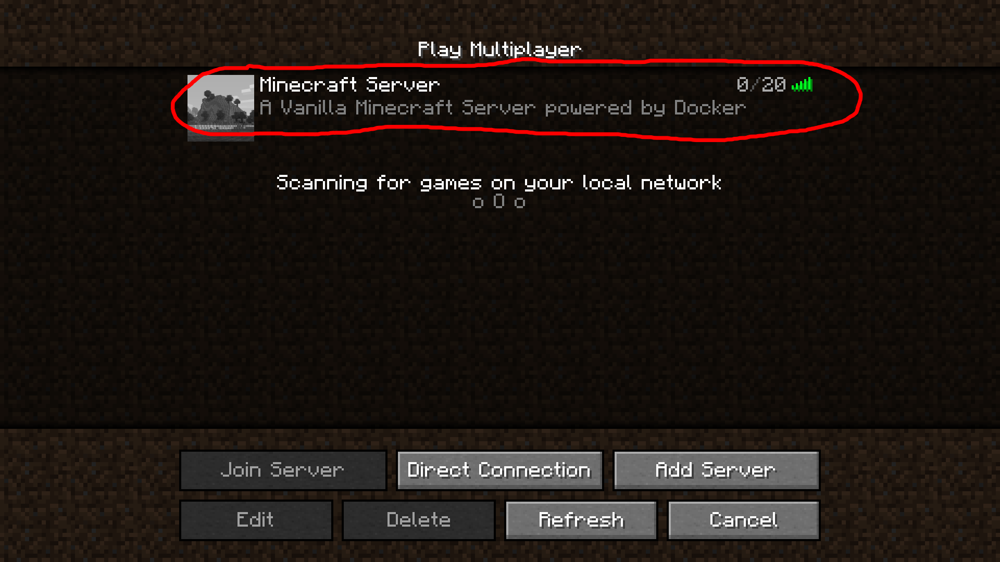

# Minecraft-2.0 - [Video Link](https://clipchamp.com/watch/CCHYsbnp36w)
## Background

### What Will We Do?

Make a Minecraft server using an AWS account that is able to auto reboot and shutdown with systemd services

### How Will We Do it?

Using Git/GitHub, Terraform, AWS and the AWS command line interface, and Docker!

Thank you to Darrell Davis for their [Terraform-AWS-Minecraft](https://github.com/darrelldavis/terraform-aws-minecraft) repository, which helped me understand how AWS works with Terraform, and Geoff Bourne for their [Docker Minefract image](https://github.com/itzg/docker-minecraft-server), which helped with the quick and painless setup for it all.

Note: I did use some of my previous work from the Midterm as well

## Requirements

- Personal computer/laptop with WiFi or Ethernet access
- An AWS account
     - Note: This tutorial is made using the AWS Academy, so results may vary if you're using a regular AWS account
- Git installed (2.41.0)
    - Linux: `sudo apt install git-all` or `sudo dnf install git-all`
    - MacOS: `git --version`
    - Windows: [Installation Link](https://git-scm.com/download/win)
    - [Help](https://git-scm.com/book/en/v2/Getting-Started-Installing-Git)
 - Terraform installed (1.4.6)
     - Linux - Debian-based: [Script](https://github.com/awhittle2/Minecraft-2.0/blob/scripts/linux-terraform-install.sh)
     - Linux - RHEL-based: [Script](https://github.com/awhittle2/Minecraft-2.0/blob/scripts/linux-terraform-install2.sh)
     - MacOS: [Script](https://github.com/awhittle2/Minecraft-2.0/blob/scripts/mac-terraform-install.sh)
     - Windows - Chocolatey: `choco install terraform`
     - [Help](https://developer.hashicorp.com/terraform/tutorials/aws-get-started/install-cli)
 - AWC CLI installed (2.0)
     - Linux: `curl "https://awscli.amazonaws.com/awscli-exe-linux-x86_64.zip" -o "awscliv2.zip"
               unzip awscliv2.zip
               sudo ./aws/install`
     - MacOS: `curl "https://awscli.amazonaws.com/AWSCLIV2.pkg" -o "AWSCLIV2.pkg"
               sudo installer -pkg AWSCLIV2.pkg -target /`
     - Windows: `msiexec.exe /i https://awscli.amazonaws.com/AWSCLIV2.msi`
     - [Help](https://docs.aws.amazon.com/cli/latest/userguide/getting-started-install.html)
 - A Minecraft Client (1.19.4) 
     - Note: This will still work without one, however, you wouldn't be able to play minecraft without it!

## Diagram of My Steps


## Diagram of Your Steps


## Is it Really That Simple?

Yes! Terraform and Docker will handle everything for us, so there is no need to worry about other tools or provisioning.

## List of Commands to Run

```bash
# Clone the repository
git clone https://github.com/awhittle2/Minecraft-2.0.git
cd Minecraft-2.0/

# Enter your AWS account details
```
What you'll need:
- Your AWS Access Key ID
- Your AWS Secret Access Key
- Your AWS Session Token

Where to go to find it:
1. Start your Learner Lab
2. Click `AWS Details`
3. Click `AWS CLI: Show`


```bash
# Replace the underscores with your AWS credentials
export AWS_ACCESS_KEY_ID=___
export AWS_SECRET_ACCESS_KEY=___
export AWS_SESSION_TOKEN=___

# Make sure that main.tf is there
ls

# Initialize the terraform prjoect
terraform init

# Apply the changes
terraform apply

# Wait about 5 minutes for it to create the instance and run the set-up script

# Then, connect to the Minecraft Server using the IP address that prints out
# If you do not know how, please refer to the last section of this README file

# Lastly, to test if it auto-starts on reboot, replace the underscores with the instance ID that also gets printed out, and press enter
aws ec2 reboot-instances --instance-ids i-___
```

## Explanation of Terraform Script

Part 1.

```
terraform {
  required_providers {
    aws = {
      source  = "hashicorp/aws"
      version = "~> 4.16"
    }
  }

  required_version = ">= 1.2.0"
}
```

This part of the script is simply for the resources and versioning, which is required by Terraform and included in their [tutorial](https://developer.hashicorp.com/terraform/tutorials/aws-get-started/aws-build)

Part 2.

```
provider "aws" {
  region = "us-west-2"
}

resource "aws_key_pair" "minecraft_key_3" {
  key_name = "minecraft_key_3"
  public_key = file("~/minecraft-2.pub")
}
```

Part 2 defines the region you want your aws instance to be in (it's recommended that you choose what ever is closest to you) and defines the name and location of your public key file, which you will use to ssh into your instance if need be.

Note: I did not have to ssh into my instance at all to create this Minecraft server, but if something goes wrong, it might help to have the option to log in and look around. If you are interested, here is a [guide](https://docs.aws.amazon.com/AWSEC2/latest/UserGuide/AccessingInstancesLinux.html) to do so.

Part 3.

```
resource "aws_security_group" "minecraft_sg_3" {
  ingress {
    from_port   = 25565
    to_port     = 25565
    protocol    = "tcp"
    cidr_blocks = ["0.0.0.0/0"]
  }
  ingress {
    from_port = 22
    to_port = 22
    protocol = "tcp"
    cidr_blocks = ["0.0.0.0/0"]
  }
  egress {
    from_port = 0
    to_port = 0
    protocol = "-1"
    cidr_blocks = ["0.0.0.0/0"]
  }
  tags = {
    Name = "Minecraft-3"
  }
}
```

This section is extremely important as it defines the security rules for your Minecraft server. It is recommended that you change the SSH rule (aka the from_port 22 and to_port 22) to your personal IP address for security purposes, but for now it is alright. Without these rules, no one will be able to connect, so make sure that you have them!

Part 4.

```
resource "aws_instance" "minecraft_3" {
  ami           = "ami-03f65b8614a860c29"
  instance_type = "t3.small"
  vpc_security_group_ids = [aws_security_group.minecraft_sg_3.id]
  associate_public_ip_address = true
  key_name = aws_key_pair.minecraft_key_3.key_name
  user_data = <<-EOF
  #!/bin/bash
  # Update system
  sudo apt-get update

  # Install dependencies
  sudo apt-get install ca-certificates curl gnupg

  # Setup Docker repository
  sudo install -m 0755 -d /etc/apt/keyrings
  curl -fsSL https://download.docker.com/linux/ubuntu/gpg | sudo gpg --dearmor -o /etc/apt/keyrings/docker.gpg
  sudo chmod a+r /etc/apt/keyrings/docker.gpg
  echo "deb [arch=\"$(dpkg --print-architecture)\" signed-by=/etc/apt/keyrings/docker.gpg] https://download.docker.com/linux/ubuntu $(. /etc/os-release && echo \"$VERSION_CODENAME\") stable" | sudo tee /etc/apt/sources.list.d/docker.list > /dev/null

  # Update system again
  sudo apt-get update

  # Install Docker Engine
  sudo apt-get install -y docker-ce docker-ce-cli containerd.io docker-buildx-plugin docker-compose-plugin

  # Install Docker Compose
  sudo apt-get install -y docker-compose

  # Setup Minecraft directory
  mkdir /home/ubuntu/minecraft_directory
  cd /home/ubuntu/minecraft_directory

  # Create docker-compose.yml file
  cat << DOCKER_COMPOSE > docker-compose.yml
  version: "3"

  services:
    mc:
      image: itzg/minecraft-server:java17-alpine
      ports:
          - 25565:25565
      environment:
          EULA: "TRUE"
      tty: true
      stdin_open: true
      restart: unless-stopped
      volumes:
          - ./minecraft-data:/data
  DOCKER_COMPOSE
  # Start the server
  sudo docker-compose up -d

  # Create systemd service
  sudo bash -c 'cat > /etc/systemd/system/minecraft.service << SYSTEMD_SERVICE
  [Unit]
  Description=Minecraft Server
  After=docker.service
  Requires=docker.service

  [Service]
  WorkingDirectory=/home/ubuntu/minecraft_directory
  ExecStart=/usr/bin/docker-compose up
  ExecStop=/usr/bin/docker-compose down
  Restart=always
  User=ubuntu
  Group=docker

  [Install]
  WantedBy=multi-user.target
  SYSTEMD_SERVICE'

  # Wait for 3.5 minutes
  sleep 210

  # Enable and start the service
  sudo systemctl enable minecraft
  sudo systemctl start minecraft
EOF
  tags = {
    Name = "Minecraft-3"
  }
}
```

Don't be intimidated by this large section. Firstly it creates an instance using the AWS Ubuntu OS image, then it defines the cpu and ram with the instance type (t3.small), next it defines the security group rules (defined in part 3) and the key pair (defined in part 2), and makes sure that an IP address gets auto-assigned. Lastly, under user_data, it defines a start up script which will run when the instance is first created. It is a special, predefined variable, which is very useful in this case. Instead of worrying about running a second script or ssh-ing into your instance, you can do it all with one command in Terraform! 

Essentially, the script downloads all of the Docker dependencies, creates a Docker compose file, which will initialize our Minecraft server, then it boots it up. Afterward, it sleeps for 3.5 minutes while it waits for the Minecraft server to be up and running. Once the 3.5 minutes are over, it creates a service for the Minecraft server, so it always boots up and down with the instance. 

Part 5.

```
output "instance_ip_addr" {
  value = aws_instance.minecraft_3.public_ip
  description = "The public ip address of the instance"
}

output "instance_id" {
  value = aws_instance.minecraft_3.id
  description = "The ID of the instance"
}
```

Last but not least, part 5 just tells Terraform to output the instance ID and IP address once it has finished. The IP address is so you know how to connect to your Minecraft server and the ID is so you can pair it with other AWS CLI commands to start, stop, terminate, and more to your AWS instance.

## How to connect to the Minecraft server once it's running?

1. Load up your Minecraft client
3. Click on `Multiplayer`
   
5. Select `Add Server`
   
7. Under `Server Address` enter in the ip address that the terraform script outputted with `:25565` afterwards
   
9. Click `Done`
10. Wait until Minecraft is able to connect
    
12. Click `Join Server`
    
14. Have fun!
